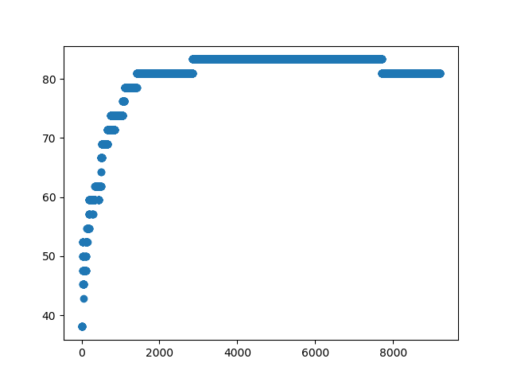
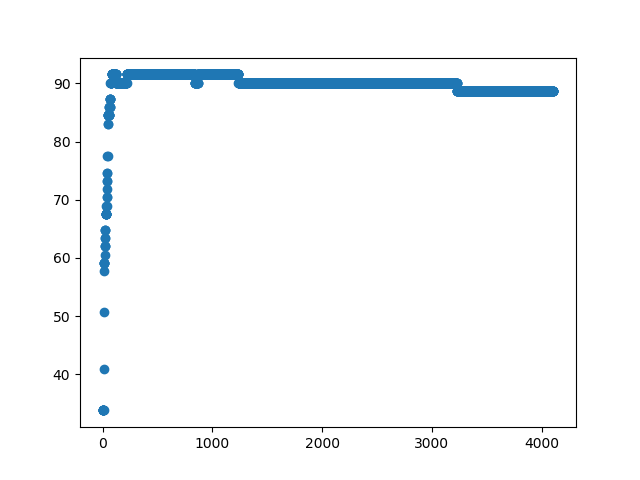

Machine Learning - Logistic Regression
======================================

### Introduction
This project is created for modeling two data sets by using logistic regression.

### Description
* Logistic regression: 
  f(x) = σ(β0 + β1x1 + β2x2 + β3x3 + ... + βpxp) 
  where x is a training sample vector of size p and σ is the sigmoid function.
* βi is found by mini-batch gradient descent.
* The log-likelihood is used as the optimization function.
* Batch size is assigned as 16. Because, batch size should be a power of 2 that fits the memory requirements of the CPU.
* There are three global variables in the program which affects the accuracy of the datasets.
  * _**LEARNING_RATE = 0.01:**_ It is the learning rate which is used to calculate βi.
  * _**CRITIC_NUM = 0.00001:**_ Log likelihood function is calculated at every iteration. If difference between last two log likelihood values is lower than this global value, iteration of learning ends.
  * _**ITERATION = 10000:**_ It is the number of iteration of learning.
* Datasets are taken from the following links:
  * [Dataset 1](https://archive.ics.uci.edu/ml/datasets/Connectionist+Bench+(Sonar,+Mines+vs.+Rocks)/)
  * [Dataset 2](https://archive.ics.uci.edu/ml/datasets/Ionosphere/)

### Results
With the global variables which are defined above: 
There is %80.95 accuracy for the first dataset. 
There is %88.73 accuracy for the second dataset. 
Accuracy of the datasets will change if you change values of the global variables.

You can see the curves where y-axis shows the test accuracy and x-axis shows the iteration of learning.

Dataset 1                     | Dataset 2
----------------------------- | -----------------------------
 | 

### License
Copyright 2019 Burak Kuyucu

Licensed under the Apache License, Version 2.0 (the "License");
you may not use this file except in compliance with the License.
You may obtain a copy of the License at

http://www.apache.org/licenses/LICENSE-2.0

Unless required by applicable law or agreed to in writing, software
distributed under the License is distributed on an "AS IS" BASIS,
WITHOUT WARRANTIES OR CONDITIONS OF ANY KIND, either express or implied.
See the License for the specific language governing permissions and
limitations under the License.

